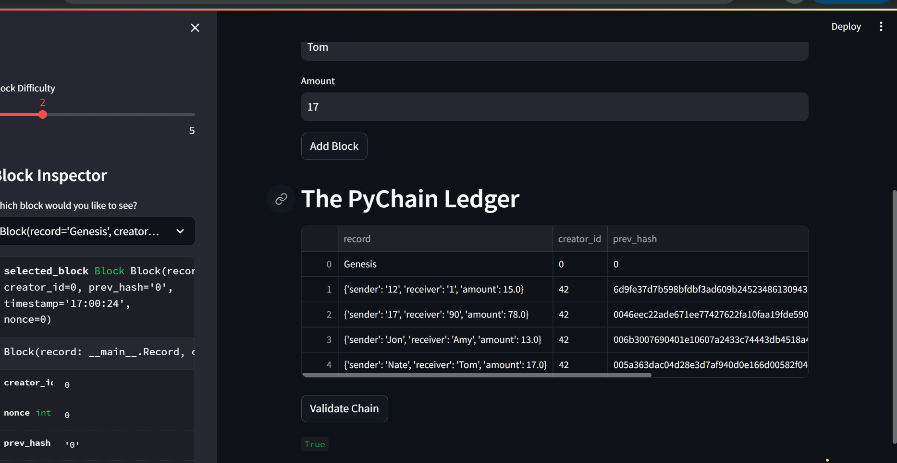
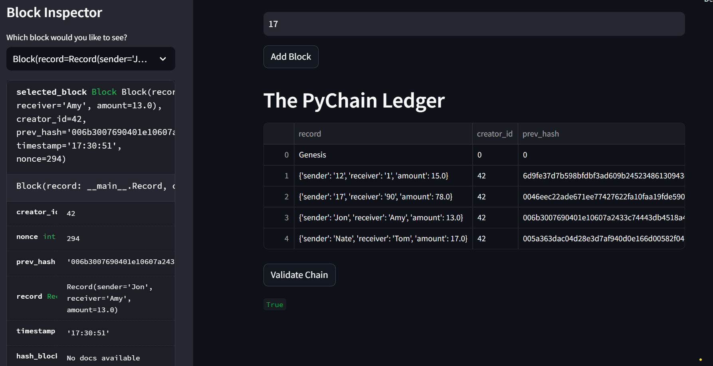

# PyChain Ledger

This project highlights the blockchain ledger know as PyChain. It is a basic blockchain system; use the provided Python file contained in the file. It will be necessary create and maintain the ledger.

## Necessary Revisions and Additions

### 1- Create a Class that Record (s) data. This will serve as the foundation of the ledger. Financial transactions and records will be stored inside the PyChain ledger using the newly made (Record) class.

### 2- Removed the existing data attribute provided initially and replaced it with our new Block that has the 'record' attribute among it's characteristics.

### 3- Modified the default user inputs. This was done so that the application is abble to collect, send, and record transactions stored in the PyChain ledger.

### 4- Lastly the ledger must have proof of concept, and should be able to run smoothly on the ledger.

## USAGE AND FUNCTIONALITY

  - To initialize and duplicate results make you begin at the specified project folder, where the corresponding file is located.
  - To run the Streamlit application, make sure that you have not navigated out of the location that the file is in. If you are in the right specified file location, then run the following code: streamlit 'run pychain.py'. This command with initialize the application and bring you to the applications dashboard.
  - Navigate to the Sender, Receiver, and Amount data boxes, and fill in each required field. Double check that the amount being sent and received matches, as well as the recipient of the transaction, proceed to and click on the 'Add Block' button.
  - If no errors express themselves, then you have successfully added a block to the blockchain ledger!
  - The last step is the wrap everything together and save it, or 'Validate' the block chain. Once the block has been validated, it is successfully added to the block.

### Screenshots Displaying PyChain ledger running in the Streamlit Application

---

© 2022 edX Boot Camps LLC. Confidential and Proprietary. All Rights Reserved.
